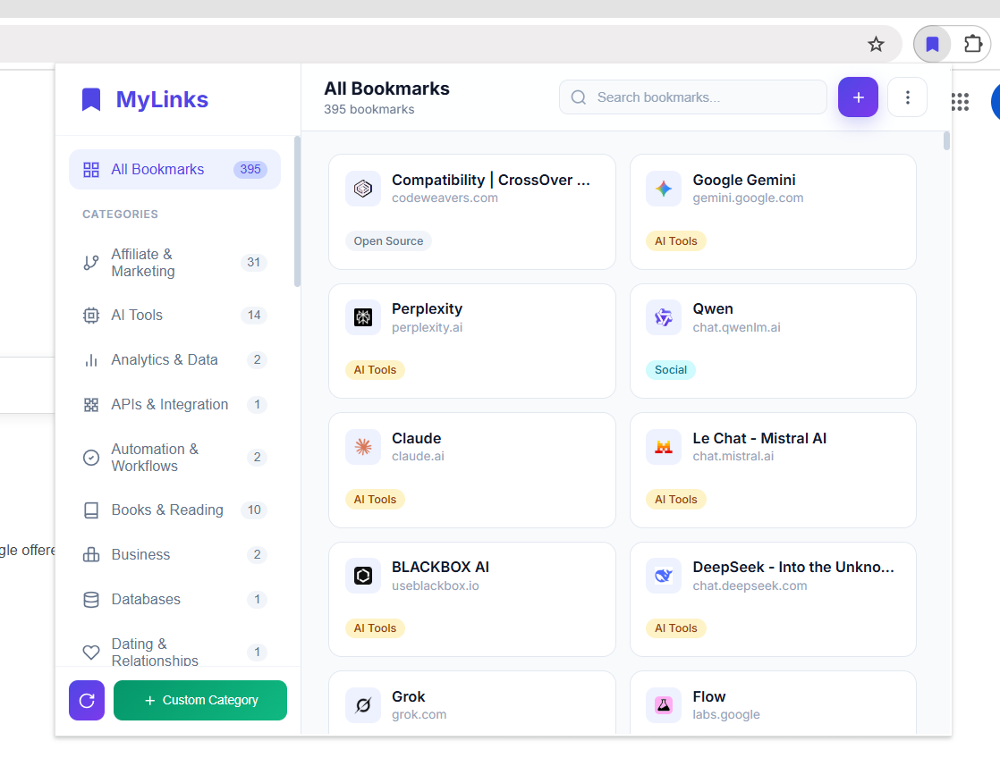

# MyLinks Dashboard

A beautiful bookmark manager Chrome extension with smart auto-categorization and 100+ built-in categories.



## Features

- 📚 **Beautiful UI** - Clean, modern interface with smooth animations
- 🔍 **Quick Search** - Instantly find bookmarks by title, URL, or category
- 🏷️ **100+ Smart Categories** - Automatically organizes bookmarks into categories like:
  - AI Tools, Development, Education, Design
  - Finance, Entertainment, Gaming, Social
  - Shopping, News, Health, Travel
  - Books, Music, Photography, Science
  - And 90+ more specialized categories!
- ➕ **Custom Categories** - Create your own categories with custom keywords
- 🔄 **Re-Categorize** - One-click to re-scan and categorize all bookmarks
- 🌐 **Favicon Support** - Shows website favicons for easy recognition
- ✏️ **Full CRUD Control** - Add, edit, and delete bookmarks without leaving the popup
- 🧠 **Auto Metadata Fetch** - Prefills titles & descriptions automatically
- 💼 **Import & Export** - Backup as JSON or generate a beautiful HTML dashboard

## Installation

1. Download or clone this repository
2. Open Chrome and navigate to `chrome://extensions/`
3. Enable "Developer mode" (toggle in top-right corner)
4. Click "Load unpacked"
5. Select the project folder
6. The extension icon will appear in your toolbar

## Usage

1. Click the extension icon in your Chrome toolbar
2. Browse all your bookmarks in a beautiful grid layout
3. Use the sidebar to filter by category
4. Search for specific bookmarks using the search bar
5. Click the refresh icon to re-categorize all bookmarks
6. Use the "+" button to add a new bookmark

### Import & Export

Access import/export options from the settings menu (⋮):

- **Import**: Import bookmarks from JSON backup or Chrome HTML export
- **Export (Chrome format)**: Create a JSON backup
- **Export (Beautiful HTML)**: Generate a standalone HTML page with all bookmarks

## File Structure

```
mylinks-dashboard/
├── manifest.json      # Chrome extension manifest (v3)
├── popup.html         # Main popup UI
├── popup.css          # Styles
├── popup.js           # Application logic
├── preview.png        # Preview screenshot
├── README.md          # This file
└── icons/             # Extension icons
    ├── icon16.png
    ├── icon32.png
    ├── icon48.png
    └── icon128.png
```

## Permissions

- **bookmarks**: Read and manage your bookmarks
- **storage**: Cache categorization data for faster loading
- **host_permissions**: Fetch metadata from URLs when adding bookmarks

## Version

Current version: **1.1.0**

## Author

Made by [gauravvyadav](https://github.com/gauravvyadav)
